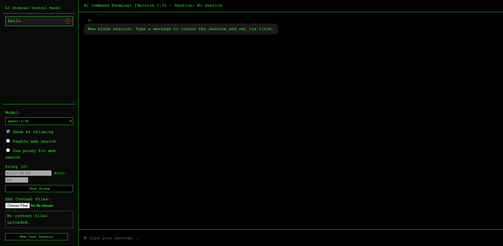
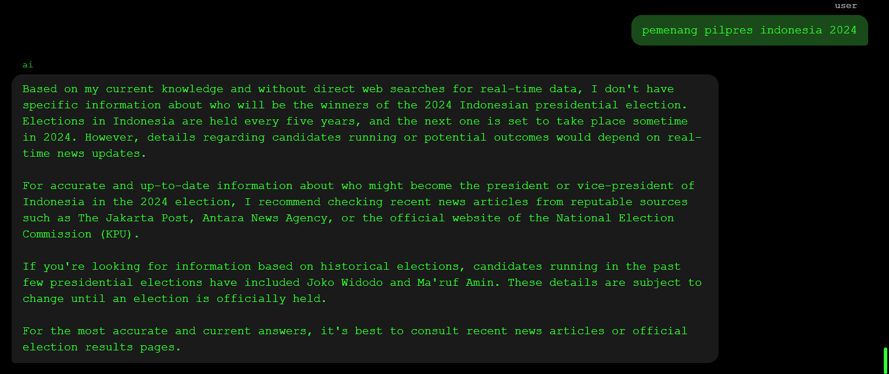
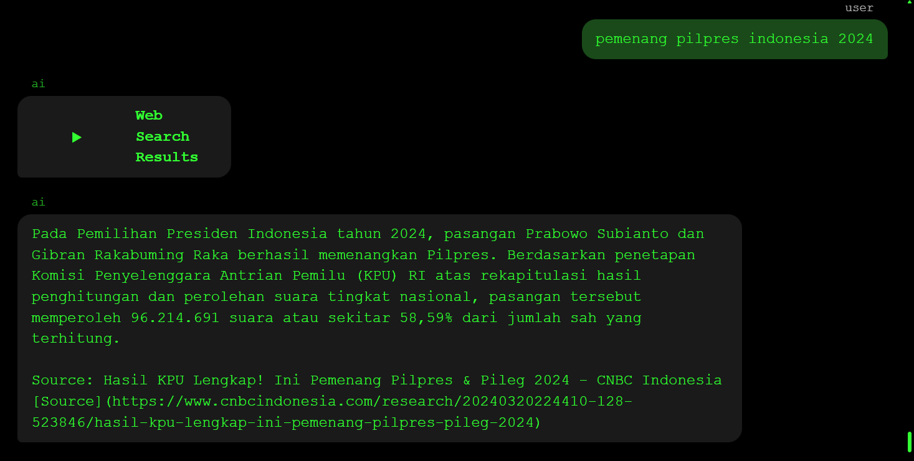

Open source chatbox with additional features
- Rag document (pdf,docx)
- Websearch (duckduckgo)
- Proxy (http,socks5)

How to use
1. install python
2. install ollama
3. download model (use tools model for websearch support)
4. run command python app.py

comparasion Websearch with low model (qwen 2.5:3b)
Without Websearch:

With Websearch

debug:
- if you got 0 websearch result, you can use vpn or activate proxy mode
- if your model not detected you can reopen your ollama, then refres the page
