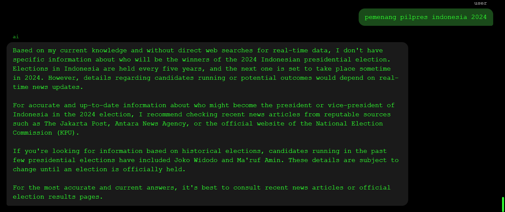
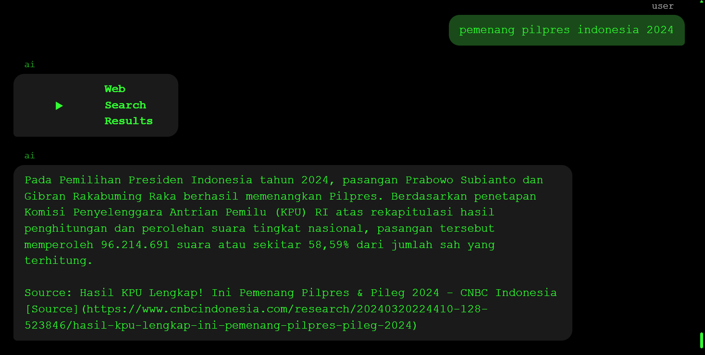
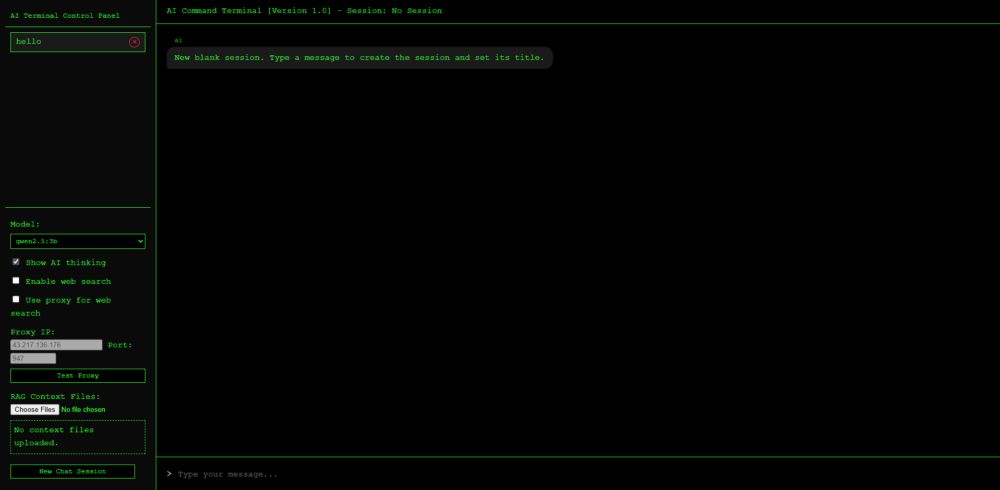

# Ollama ChatBox with WebSearch & RAG

<div align="center">

[](LICENSE)
[](https://www.python.org/)
[](https://developer.mozilla.org/en-US/docs/Web/JavaScript)

A modern, feature-rich chatbox UI powered by Ollama with integrated web search and RAG (Retrieval-Augmented Generation) capabilities.

</div>

## ✨ Features

- 🤖 **Local LLM Integration** - Powered by Ollama for offline AI capabilities
- 🌐 **Web Search** - Real-time web search using DuckDuckGo
- 📄 **RAG Support** - Document processing for PDF and DOCX files
- 🔒 **Privacy-Focused** - All processing done locally
- 🌍 **Proxy Support** - HTTP and SOCKS5 proxy configuration
- 💻 **Modern UI** - Clean and responsive web interface

## 📸 Preview

### Default Response (Without Web Search)


### With Web Search Enabled


### Full Interface


## 🚀 Quick Start

### Prerequisites

- Python 3.8 or higher
- [Ollama](https://ollama.ai) installed and running
- Node.js and npm (for frontend)

### Installation

1. **Clone the repository**
   ```bash
   git clone https://github.com/Ega-Putra/Ollama-ChatBox-WebSearch-Rag.git
   cd Ollama-ChatBox-WebSearch-Rag
   ```

2. **Install Python dependencies**
   ```bash
   pip install -r requirements.txt
   ```

3. **Install Ollama**
   - Download from [ollama.ai](https://ollama.ai)
   - Follow the installation guide for your operating system

4. **Download a Model**
   ```bash
   ollama pull qwen:7b  # Recommended for web search support
   ```

5. **Run the application**
   ```bash
   python app.py
   ```

6. **Access the application**
   - Open your browser and navigate to `http://localhost:5000`

## 📚 Supported Document Types

- ✅ PDF files (.pdf)
- ✅ Word documents (.docx)

## 🌍 Proxy Configuration

If you need to use a proxy for web searches:

1. Navigate to the settings in the UI
2. Select your proxy type (HTTP or SOCKS5)
3. Enter your proxy address and port
4. Apply settings and restart the search

## 🛠️ Troubleshooting

### Web Search Returns 0 Results
- **Solution**: Enable VPN or configure proxy mode in settings
- Check your internet connection
- Verify DuckDuckGo service availability

### Model Not Detected
- **Solution**: Restart the Ollama service
- Run `ollama pull <model-name>` to ensure the model is downloaded
- Refresh the browser page (Ctrl+R or Cmd+R)
- Check that Ollama is running on the expected port

### Performance Issues
- Use a lighter model (e.g., `qwen:3b` or `mistral:7b`) for faster responses
- Reduce document size in RAG operations
- Ensure sufficient system resources (RAM, CPU)

## 📊 Model Comparison

Below is a comparison showing the difference between responses with and without web search using the lightweight Qwen 2.5 3B model:

| Feature | Without Search | With Search |
|---------|-----------------|-------------|
| Response Time | Fast | Slightly slower |
| Information Currency | May be outdated | Up-to-date | 
| Accuracy | Good | Excellent |
| Internet Required | No | Yes |

## 🏗️ Project Structure

```
Ollama-ChatBox-WebSearch-Rag/
├── app.py                 # Main application entry point
├── requirements.txt       # Python dependencies
├── image/                 # Screenshot and preview images
│   ├── preview.png
│   ├── withSearch.png
│   └── withoutSearch.png
├── frontend/              # Web UI files
│   ├── index.html
│   ├── css/
│   └── js/
└── README.md              # This file
```

## 🔧 Configuration

Key environment variables and settings:

```bash
# Ollama Configuration
OLLAMA_HOST=localhost:11434
OLLAMA_MODEL=qwen:7b

# Application Configuration
APP_PORT=5000
APP_HOST=0.0.0.0

# Proxy Configuration (Optional)
PROXY_TYPE=none  # none, http, socks5
PROXY_URL=
PROXY_PORT=
```

## 🤝 Contributing

Contributions are welcome! Here's how you can help:

1. Fork the repository
2. Create a feature branch (`git checkout -b feature/AmazingFeature`)
3. Commit your changes (`git commit -m 'Add some AmazingFeature'`)
4. Push to the branch (`git push origin feature/AmazingFeature`)
5. Open a Pull Request

## 📝 License

This project is licensed under the MIT License - see the [LICENSE](LICENSE) file for details.

## 🙋 Support

If you encounter any issues or have questions:

- Open an [Issue](https://github.com/Ega-Putra/Ollama-ChatBox-WebSearch-Rag/issues)
- Check existing [Discussions](https://github.com/Ega-Putra/Ollama-ChatBox-WebSearch-Rag/discussions)
- Review the [Troubleshooting](#-troubleshooting) section above

## 🙌 Acknowledgments

- [Ollama](https://ollama.ai) - Local LLM runtime
- [DuckDuckGo](https://duckduckgo.com) - Search engine
- Built with ❤️ by the community

---

<div align="center">

**Give this project a ⭐ if you found it helpful!**

</div>
